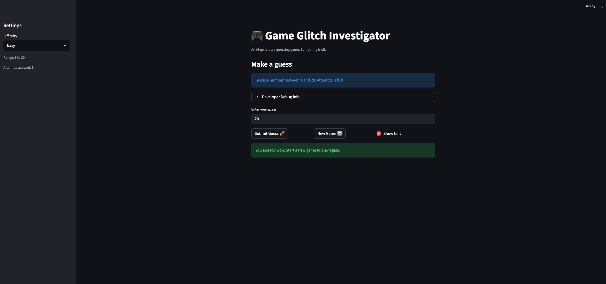

# 🎮 Game Glitch Investigator: The Impossible Guesser

## 🚨 The Situation

You asked an AI to build a simple "Number Guessing Game" using Streamlit.
It wrote the code, ran away, and now the game is unplayable. 

- You can't win.
- The hints lie to you.
- The secret number seems to have commitment issues.

## 🛠️ Setup

1. Install dependencies: `pip install -r requirements.txt`
2. Run the broken app: `python -m streamlit run app.py`

## 🕵️‍♂️ Your Mission

1. **Play the game.** Open the "Developer Debug Info" tab in the app to see the secret number. Try to win.
2. **Find the State Bug.** Why does the secret number change every time you click "Submit"? Ask ChatGPT: *"How do I keep a variable from resetting in Streamlit when I click a button?"*
3. **Fix the Logic.** The hints ("Higher/Lower") are wrong. Fix them.
4. **Refactor & Test.** - Move the logic into `logic_utils.py`.
   - Run `pytest` in your terminal.
   - Keep fixing until all tests pass!

## 📝 Document Your Experience

### Game Purpose

Glitchy Guesser is a number guessing game built with Streamlit where the player picks a difficulty (Easy, Normal, or Hard), which sets the range and attempt limit, then tries to guess a randomly chosen secret number. After each guess the game shows a "Too High" or "Too Low" hint. The player wins by guessing correctly before running out of attempts, and earns a score based on how few guesses it took.

### Bugs Found

1. Hint messages were backwards — "Too High" told you to go HIGHER and "Too Low" told you to go LOWER.
2. The secret was cast to a string on even-numbered attempts, breaking comparisons on those turns.
3. `st.rerun()` was called right after showing the hint, clearing the message before the player could read it.
4. The attempts counter was initialized to `1` instead of `0`, causing the "out of attempts" message to appear one turn too early.
5. The info bar hardcoded "Guess a number between 1 and 100" regardless of the selected difficulty.
6. The New Game button used a hardcoded range and did not reset `status`, `score`, or `history`.
7. The starter tests compared the full tuple returned by `check_guess` to a plain string, so all three tests failed.

### Fixes Applied

1. Swapped the hint messages in `check_guess` so "Too High" directs the player lower and "Too Low" directs them higher.
2. Removed the even/odd type-coercion block and always pass the integer secret to `check_guess`.
3. Removed `st.rerun()` from the wrong-guess branch so the hint stays visible after each guess.
4. Changed the attempts initialization from `1` to `0` so the counter is accurate from the first guess.
5. Updated the info bar to use the `low` and `high` variables so it reflects the chosen difficulty.
6. Fixed the New Game button to use the correct difficulty range and reset all session state fields.
7. Updated the starter tests to unpack the tuple return value and added a new test targeting the backwards-hint bug.

## 📸 Demo

- [ ] [Insert a screenshot of your fixed, winning game here]

## 🚀 Stretch Features

- [ ] [If you choose to complete Challenge 4, insert a screenshot of your Enhanced Game UI here]
